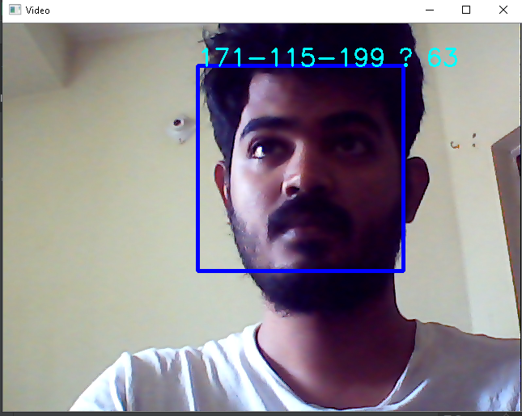

# Face_recognition_attedence

<h2>Face recognition based attendence system.<h2>

  1. User can train their own face.

2. Using web cam user can input face and roll Number.

3. it has a code video to image which help to take image from video

4. User can get exel file formate from the main application

 <h3>It will first detect face when the application started</h3>

  
<h3>Then it will output exel formate file with date and all student roll and im the student is absent it show "A" else "P" for present</h3>

python library for this code

pip install opencv-python

pip install opencv-contrib-python

pip install Pillow

pip install openpyxl
